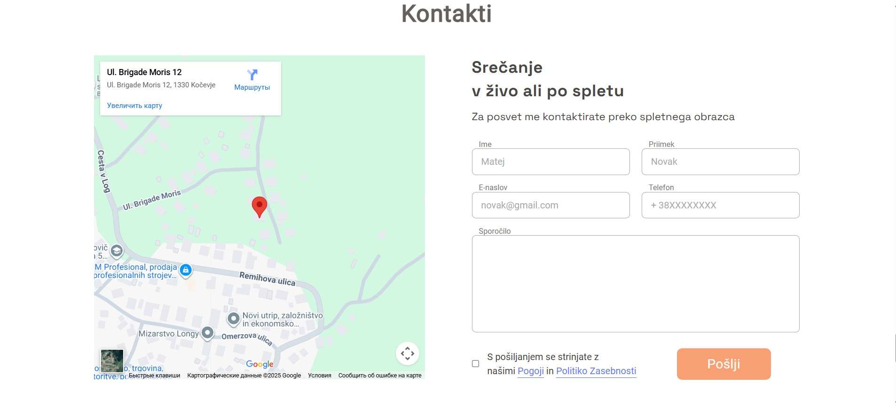

# Personal and Relationship Counseling Website

A commercial website created for a psychologist and personal & relationship counselor in Slovenia — **Toni Mrvič**.  
The website introduces the counselor’s services, approach, and experience, helping visitors find inner balance, improve relationships, and build self-confidence.

---

## 🔧 Technologies Used

**Frontend:**
- HTML5  
- SCSS / CSS3  
- JavaScript (ES6)  
- jQuery  
- Slick Carousel  

**Build Tools & Optimization:**
- Webpack 5  
- Babel  
- PostCSS + postcss-preset-env  
- Sass Loader  
- HTML Webpack Plugin  
- CSS Loader, Style Loader, MiniCssExtractPlugin  
- Image Webpack Loader  
- CSS Minimizer Plugin  
- Webpack Dev Server  

**Polyfills:**
- @babel/polyfill  

---

## 🚀 Features
- Professional presentation of the counselor and his services  
- Description of counseling approach and philosophy  
- Contact information and consultation request option  
- Responsive, minimalistic, and emotionally balanced design  
- Optimized images and assets for fast loading  

---

## 📸 Screenshots / Demo
  
  

**Live Demo:** [View Website](https://letim.si/)

---

## 💻 Local Setup
To run the project locally:

``bash
git clone https://github.com/alexmiziuk/psychology.git
cd psychology
npm install
npm run dev

---

## 📄 License
MIT License © Oleksandr Miziuk

---

## ✉ Contact
**Email:** oleksandr.miziyk@gmail.com
**GitHub:** [github.com/alexmiziuk](https://github.com/alexmiziuk)

